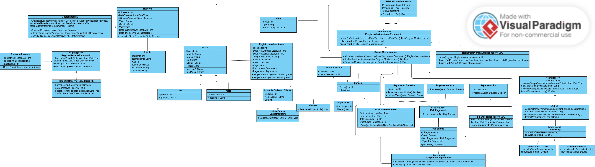

# Sistema de Estacionamento


> Projeto acadêmico da disciplina de **Projeto de Arquitetura de Sistemas** — Ciência da Computação, UNIFOR

## Sobre o Projeto

Este projeto trata da modelagem e implementação de um sistema de controle de estacionamento (vagas, reservas, movimentação de veículos, pagamentos e relatórios), com ênfase na aplicação consciente dos **princípios SOLID** e dos **padrões GRASP** durante o desenho da arquitetura orientada a objetos — da modelagem em UML até a tradução para código Java.

O escopo não foi definido por um enunciado fechado: coube ao grupo escolher o domínio (estacionamento) e delimitar as funcionalidades, priorizando a qualidade das decisões arquiteturais em detrimento de simplesmente ter algo funcionando.

## Diagrama de Classes



## Princípios de Projeto Aplicados

### SOLID

| Princípio | Onde é aplicado |
|---|---|
| **SRP** | Cada classe de serviço cuida de uma única responsabilidade: `ControleCadastroCliente` trata só de cadastro, `GestorReserva` só de reservas, `GestorMovimentacao` só de entrada/saída de veículos. |
| **OCP** | A hierarquia `Veiculo` → `Carro`/`Moto`, junto com as interfaces `IMeioPagamento` e `ITabelaPreco`, permite incluir novos tipos de veículo, meio de pagamento ou regra de tarifa criando uma classe nova, sem tocar no que já existe. |
| **LSP** | `PagamentoDinheiro`, `PagamentoCartao` e `PagamentoPix` cumprem o mesmo contrato de `IMeioPagamento` e podem ser trocadas entre si sem que o restante do sistema perceba diferença de comportamento. |
| **ISP** | As interfaces foram mantidas pequenas e focadas (`ICalculoTarifa`, `ICadastroCliente`, `ITabelaPreco`), evitando um contrato único e genérico que forçasse implementações a lidar com métodos que não usam. |
| **DIP** | As classes de mais alto nível (`GestorReserva`, `GestorMovimentacao`, `Pagamento`) dependem das abstrações (`ITabelaPreco`, `IMeioPagamento`, `ICalculoTarifa`), e não das implementações concretas diretamente. |

### GRASP

| Padrão | Onde é aplicado |
|---|---|
| **Information Expert** | `RegistroMovimentacao.registrarEntrada()/registrarSaida()` — a própria classe que tem os dados de horário é responsável por atualizá-los. |
| **Creator** | `GestorReserva` é responsável por instanciar `Reserva`; `GestorMovimentacao` é responsável por instanciar `RegistroMovimentacao`. |
| **Controller** | `GestorReserva`, `GestorMovimentacao` e `ControleCadastroCliente` concentram a coordenação entre as ações do sistema e as regras de negócio. |
| **Low Coupling / High Cohesion** | Dependência sempre via interface, nunca via classe concreta; cada classe mantém foco em uma única responsabilidade. |
| **Polymorphism** | A escolha de qual meio de pagamento ou tabela de preço usar é resolvida por tipo (polimorfismo de interface), sem cadeias de `if/else`. |
| **Pure Fabrication** | `RegistroReservaRepositorioSQL`, `RegistroMovimentacaoRepositorioSQL`, `PagamentoRepositorioSQL` e `Calculo` não correspondem a nenhum conceito do domínio real — foram criadas para manter a arquitetura desacoplada. |
| **Indirection** | `Pagamento` atua como intermediário entre `GestorMovimentacao` e as implementações concretas de `IMeioPagamento`. |
| **Protected Variations** | As interfaces `IMeioPagamento`, `ITabelaPreco` e as de repositório blindam o restante do sistema contra mudanças internas em pagamento, tarifação e persistência. |

## Tecnologias

- **Java 17+** 
- **IntelliJ IDEA**

## Estrutura do Projeto

```
src/br/com/estacionamento/
├── model/           # Veiculo, Carro, Moto, Cliente, Funcionario, Vaga, Reserva, Pagamento...
├── interfaces/      # IMeioPagamento, ITabelaPreco, ICalculoTarifa, I*Repositorio...
├── service/         # GestorReserva, GestorMovimentacao, ControleCadastroCliente, Calculo...
│   └── relatorio/   # RelatorioReserva, RelatorioMovimentacao, RelatorioFinanceiro
└── repository/      # RegistroReservaRepositorioSQL, RegistroMovimentacaoRepositorioSQL, FinanceiroRepositorioSQL
```

## Funcionalidades

- Cadastro de clientes
- Reserva de vagas
- Registro de entrada e saída de veículos
- Cálculo de tarifa conforme tipo de veículo e tempo de permanência
- Pagamento via dinheiro, cartão ou pix
- Simulação dos componentes físicos do estacionamento (sensor, câmera, cancela, impressora)
- Emissão de relatórios administrativos (financeiro, movimentação e reservas)

## Como Executar

> ⚠️ **Status atual:** projeto ainda em fase de modelagem e arquitetura — sem persistência real em banco de dados e sem uma classe `Main` de demonstração até o momento. As instruções abaixo valem assim que ela for adicionada.

**Pré-requisito:** JDK 17 ou superior instalado.

### Pela IntelliJ IDEA (recomendado)

1. Abra a pasta do projeto (`File → Open`).
2. Confirme que a pasta `src` aparece em azul na árvore de arquivos (indica que está marcada como *Sources Root*).
3. Localize a classe `Main.java` e clique com o botão direito sobre ela.
4. Selecione **Run 'Main.main()'**.
5. A saída aparece no painel *Run*, na parte inferior da IDE.

### Pelo terminal

```bash
# a partir da pasta src, compila todos os .java para a pasta out/
javac -d out $(find br -name "*.java")

# executa a classe Main
java -cp out br.com.estacionamento.Main
```

No Windows (PowerShell), troque `$(find br -name "*.java")` por:

```powershell
Get-ChildItem -Recurse -Filter *.java br | ForEach-Object { $_.FullName }
```

## Autores

- **Samuel Batista Oliveira** 
- **Pedro Lucas de Oliveira Duarte** 
- **José Valter Alves de Lima Junior** 

Disciplina: Projeto de Arquitetura de Sistemas — Prof. Ronaldo Pinheiro